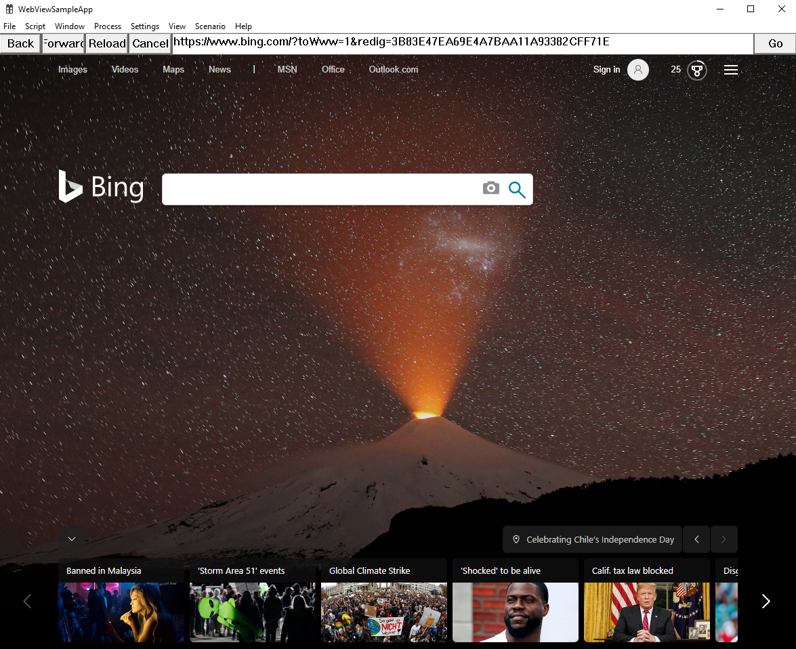
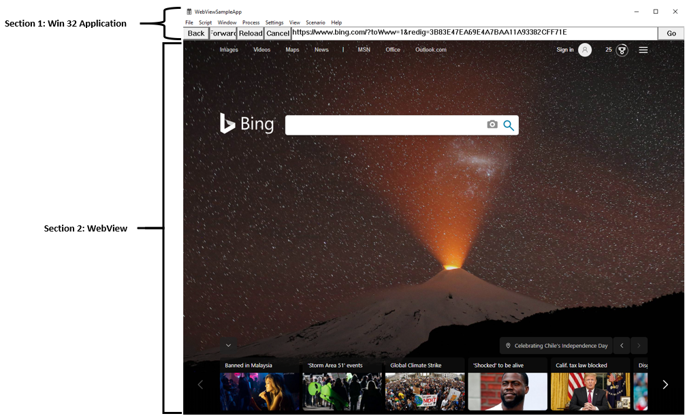

# WebView2 API Sample

This is a hybrid application built with the [Microsoft Edge WebView2](https://docs.microsoft.com/en-us/microsoft-edge/hosting/webview2) control.




The WebView2APISample is an example of an application that embeds a WebView within a Win32 native application. It is built as a Win32 [Visual Studio 2019](https://visualstudio.microsoft.com/vs/) project and makes use of both C++ and HTML/CSS/JavaScript in the WebView2 environment.

The API Sample showcases a selection of WebView2’s event handlers and API methods that allow a native Win32 application to directly interact with a WebView and vice versa.

If this is your first time using WebView, we recommend first following the [Getting Started](https://docs.microsoft.com/en-us/microsoft-edge/hosting/webview2/gettingstarted) guide, which goes over how to create a WebView2 and walks through some basic WebView2 functionality.

To learn more specifics about events and API Handlers in WebView2, you can refer to the [WebView2 Reference Documentation](https://docs.microsoft.com/en-us/microsoft-edge/hosting/webview2/reference/iwebview2webview).

## Prerequisites

- [Microsoft Edge (Chromium)](https://www.microsoftedgeinsider.com/en-us/download/) installed on a supported OS. Currently we recommend the latest version of the Edge Canary channel.
- [Visual Studio](https://visualstudio.microsoft.com/vs/) with C++ support installed.

## Build the WebView2 API Sample

Clone the repository and open the solution in Visual Studio. WebView2 is already included as a NuGet package* in this project.

- Clone this repository
- Open the solution in Visual Studio 2019**
- Set the target you want to build (Debug/Release, x86/x64)
- Build the solution file: WebView2ApiSample.sln

That's it! Everything should be ready to just launch the app.

*You can get the WebView2 NugetPackage through the Visual Studio NuGet Package Manager.

**You can also use Visual Studio 2017 by changing the project's Platform Toolset in Project Properties/Configuration properties/General/Platform Toolset. You might also need to change the Windows SDK to the latest version available to you.

## Application architecture

The API Sample App is an example of a hybrid application. It has two parts: a Win32 native part and a WebView part. The Win32 part can access native Windows APIs, while the WebView container can utilize standard web technologies (HTML, CSS, JavaScript).

This hybrid approach allows you to create and iterate faster using web technologies, while still being able to take advantage of native functionalities. The Sample App specifically demonstrates how both components can interact with each other.

Both of these parts of the Sample App are displayed in the image below:


1. Section One: The top part of the Sample App is a Win32 component written in C++. This part of the application takes in UI inputs from the user and uses them to control the WebView.

2. Section Two: The main part of the Sample App is a WebView that can be repurposed using standard web technologies (HTML/CSS/JavaScript). It can be navigated to websites or local content.

## Project Files

This section briefly explains some key files within the repository. The WebView2APISample is divided vertically into components, instead of horizontally into layers.  Each component implements the whole workflow of a category of example features, from listening for menu commands, to calling WebView API methods to implement them.

#### 1. App.cpp
This is the top-level file that runs the Sample App. It reads command line options, sets up the process environment, and handles the app's threading model.

#### 2. AppWindow.cpp
This file implements the application window. In this file, we first set up all the Win32 controls. Second, we initialize the WebView Environment and the WebView. Third, we add some event handlers to the WebView and create all the components that handle various features of the application. The AppWindow class itself handles commands from the application's Window menu.

#### 3. FileComponent.cpp
This component handles commands from the File menu (except for Exit), as well as the DocumentTitleChanged event.

#### 4. ScriptComponent.cpp
This component handles commands from the Script menu, which involve interacting with the WebView by injecting JavaScript, posting WebMessages, adding native objects to the webpage, or using the DevTools protocol to communicate with the webpage.

#### 5. ProcessComponent.cpp
This component handles commands from the Process menu, which involve interaction with the browser's process. It also handles the ProcessFailed event, in case the browser process or one of its render process crashes or is unresponsive.

#### 6. SettingsComponent.cpp
This component handles commands from the Settings menu, and is also in charge of copying settings from an old WebView when a new one is created. Most code that interacts with the IWebView2Settings interface can be found here.

#### 7. ViewComponent.cpp
This component handles commands from the View menu, and any functionality related to sizing and visibility of the WebView. When the app window is resized, minimized, or restored, ViewComponent will resize, hide, or show the WebView in response. It also responds to the ZoomFactorChanged event.

#### 8. ScenarioWebMessage.cpp and ScenarioWebMessage.html
This component is created when you select the Scenario/Web Messaging menu item. It implements an example application with a C++ part and an HTML+JavaScript part, which communicate with each other by asynchronously posting and recieving messages.


#### 9. ScenarioAddRemoteObject.cpp and ScenarioAddRemoteObject.html
This component is created when you select the Scenario/Remote Objects menu item. It demonstrates communication between the native app and the HTML webpage by means of remote object injection.  The interface of the remote object is declared in RemoteObjectSample.idl, and the object itself is implemented in RemoteObjectSampleImpl.cpp.

## Key Functions
The section below briefly explains some of the key functions in the Sample App.

### AppWindow.cpp

#### InitializeWebView()
In the AppWindow file, we use the InitializeWebView() function to create the WebView2 environment by using [CreateWebView2EnvironmentWithDetails](https://docs.microsoft.com/en-us/microsoft-edge/hosting/webview2/reference/webview2.idl#createwebview2environmentwithdetails).

Once we've created the environment, we create the WebView by using CreateWebView().

To see these API calls in action, refer to the following code snippet from InitializeWebView().

``` c++
HRESULT hr = CreateWebView2EnvironmentWithDetails(
    subFolder, nullptr,
    additionalBrowserSwitches,
    Callback<IWebView2CreateWebView2EnvironmentCompletedHandler>(
        this, &AppWindow::OnCreateEnvironmentCompleted).Get()));
if (!SUCCEEDED(hr))
{
    if (hr == HRESULT_FROM_WIN32(ERROR_FILE_NOT_FOUND))
    {
        MessageBox(m_mainWindow, L"Couldn't find Edge installation. "
            "Do you have a version installed that's compatible with this "
            "WebView2 SDK version?", nullptr, MB_OK);
    }
    else
    {
        ShowFailure(hr, L"Failed to create webview environment");
    }
}
```

#### OnCreateEnvironmentCompleted()

This callback function is passed to CreateWebView2EnvironmentWithDetails() in InitializeWebView().  It stored the environment pointer and then uses it to create a new WebView.

``` c++
HRESULT AppWindow::OnCreateEnvironmentCompleted(
    HRESULT result, IWebView2Environment* environment)
{
    CHECK_FAILURE(result);

    CHECK_FAILURE(environment->QueryInterface(IID_PPV_ARGS(&m_webViewEnvironment)));

    CHECK_FAILURE(m_webViewEnvironment->CreateWebView(
        m_mainWindow, Callback<IWebView2CreateWebViewCompletedHandler>(
            this, &AppWindow::OnCreateWebViewCompleted).Get()));

    return S_OK;
}
```

#### OnCreateWebViewCompleted()

This callback function is passed to CreateWebView() in InitializeWebView(). Here, we initialize the WebView-related state, register some event handlers, and create the app components.

#### RegisterEventHandlers()

This function is called within OnCreateWebViewCompleted(). It sets up some of the event handlers used by the application, and adds them to the WebView.

To read more about event handlers in WebView2, you can refer to this [documentation](https://docs.microsoft.com/en-us/microsoft-edge/hosting/webview2/reference/iwebview2webview).

Below is a code snippet from RegisterEventHandlers(), where we set up an event handler for the NewWindowRequested event. This event is fired when JavaScript in the webpage calls window.open(), and our handler makes a new AppWindow and passes the new window's WebView back to the browser so it can return it from the window.open() call. Unlike our calls to CreateWebViewEnvironmentWithDetails() and CreateWebView(), instead of providing a method for the callback, we just provide a C++ lambda right then and there.

``` c++
CHECK_FAILURE(m_webView->add_NewWindowRequested(
    Callback<IWebView2NewWindowRequestedEventHandler>(
        [this](IWebView2WebView* sender,
            IWebView2NewWindowRequestedEventArgs* args)
{
    wil::com_ptr<IWebView2Deferral> deferral;
    CHECK_FAILURE(args->GetDeferral(&deferral));

    auto newAppWindow = new AppWindow(L"");
    newAppWindow->m_onWebViewFirstInitialized =
        [args, deferral, newAppWindow]()
    {
        CHECK_FAILURE(args->put_NewWindow(newAppWindow->m_webView.get()));
        CHECK_FAILURE(args->put_Handled(TRUE));
        CHECK_FAILURE(deferral->Complete());
    };

    return S_OK;
}).Get(), &m_newWindowRequestedToken));
```

### ScenarioWebMessage

The ScenarioWebMessage files show how the Win32 Host can modify the WebView, how the WebView can modify the Win32Host, and how the WebView can modify itself by accessing information from the Win32 Host. This is done asynchronously.

The following sections demonstrate how each discrete function works using the Sample App and then explains how to implement this functionality.

First, navigate to the ScenarioWebMessage application within the Sample App, using the following steps:

1. Open the Sample App
2. Click on Scenario
3. Click on Web Messaging

The WebView should display a simple webpage titled: "WebMessage sample page". The code for this page can be found in the ScenarioWebMessage.html file.


To better understand ScenarioWebMessage functionality, you can either follow the instructions on the page or the steps detailed below.

#### 1. Posting Messages (Win32 Host to WebView)
The following steps show how the Win32 Host can modify a WebView. In this example, you will turn the text blue:

1. Click on Script in the Toolbar
2. Click on Post Web Message JSON

A dialog box with the pre-written code {"SetColor":"blue"} should appear.

3. Click OK

The text under Posting Messages should now be blue.

Here's how it works:

1. In ScriptComponent.cpp, we use [PostWebMessageAsJson](https://docs.microsoft.com/en-us/microsoft-edge/hosting/webview2/reference/iwebview2webview#postwebmessageasjson) to post user input to the ScenarioMessage.html web application.
``` c++
// Prompt the user for some JSON and then post it as a web message.
void ScriptComponent::SendJsonWebMessage()
{
    TextInputDialog inputDialog(m_hInst, m_mainWindow);

    PCWSTR title = L"Post Web Message JSON";
    PCWSTR prompt = L"Web message JSON:";
    PCWSTR description = L"Enter the web message as JSON.";
    inputDialog.SetUserInput(L"{\"SetColor\":\"blue\"}");

    if (inputDialog.Show(title, prompt, description) == IDOK)
    {
        PCWSTR webMessageJson = inputDialog.GetUserInput();
        m_webView->PostWebMessageAsJson(webMessageJson);
    }
}
```

2. Within the web application, event listeners are used to recieve and respond to the web message. The code snippet below is from ScenarioWebMessage.html. The event listener changes the color of the text if it reads "SetColor".

``` js
window.chrome.webview.addEventListener('message', arg => {
    if ("SetColor" in arg.data) {
        document.getElementById("colorable").style.color = arg.data.SetColor;
    }
});
```

#### 2. Recieving Messages (WebView to Win32 Host)
The following steps show how the WebView can modify the Win32 Host App by changing the title of the Win32 App:

1. Locate the Title of the Sample App - the top left of the window next to the icon.
2. Under the Recieving Message section, fill out the form with the new title of your choice.
3. Click Send

Locate the Title of the Sample App, it should have changed to the title you have just inputted.

Here's how it works:

1. Within ScenarioWebMessage.html, we call [window.chrome.webview.postMessage()](https://developer.mozilla.org/en-US/docs/Web/API/Window/postMessage) to send the user input to the host application. Refer to code snippet below:
``` js
function SetTitleText() {
    let titleText = document.getElementById("title-text");
    window.chrome.webview.postMessage(`SetTitleText ${titleText.value}`);
}
```
2. Within ScenarioWebMessage.cpp, we use [add_WebMessageReceived](https://docs.microsoft.com/en-us/microsoft-edge/hosting/webview2/reference/iwebview2webview#add_webmessagereceived) to register the event handler. When we recieve the event, after validating the input, we change the title of the App Window.

``` c++
// Setup the web message received event handler before navigating to
// ensure we don't miss any messages.
CHECK_FAILURE(m_webview->add_WebMessageReceived(
    Microsoft::WRL::Callback<IWebView2WebMessageReceivedEventHandler>(
        [this](IWebView2WebView* sender, IWebView2WebMessageReceivedEventArgs* args)
{
    wil::unique_cotaskmem_string uri;
    CHECK_FAILURE(args->get_Source(&uri));

    // Always validate that the origin of the message is what you expect.
    if (uri.get() != m_sampleUri)
    {
        return S_OK;
    }
    wil::unique_cotaskmem_string messageRaw;
    CHECK_FAILURE(args->get_WebMessageAsString(&messageRaw));
    std::wstring message = messageRaw.get();

    if (message.compare(0, 13, L"SetTitleText ") == 0)
    {
        m_appWindow->SetTitleText(message.substr(13).c_str());
    }
    return S_OK;
}).Get(), &m_webMessageReceivedToken));
```

#### 3. Roundtrip (WebView to WebView)

The following steps show how the WebView can get information from the Win32 Host and modify itself by displaying the size of the Win32 App.

1. Under RoundTrip, click GetWindowBounds

The box underneath the button should display the bounds for the Sample App.

Here's how it works:

1. When the 'Get window bounds' button is clicked, the GetWindowBounds() function in ScenarioWebMessage.html gets called. It uses [window.chrome.webview.postMessage()](https://developer.mozilla.org/en-US/docs/Web/API/Window/postMessage) to send a message to the host application.

``` js
function GetWindowBounds() {
    window.chrome.webview.postMessage("GetWindowBounds");
 }
```
2. Within ScenarioWebMessage.cpp, we use [add_WebMessageReceived](https://docs.microsoft.com/en-us/microsoft-edge/hosting/webview2/reference/iwebview2webview#add_webmessagereceived) to register the recieved event handler. After validating the input, the event handler gets window bounds from the App Window. [PostWebMessageAsJson](https://docs.microsoft.com/en-us/microsoft-edge/hosting/webview2/reference/iwebview2webview#postwebmessageasjson) sends the bounds to the web application.

``` c++
if (message.compare(L"GetWindowBounds") == 0)
{
    RECT bounds = m_appWindow->GetWindowBounds();
    std::wstring reply =
        L"{\"WindowBounds\":\"Left:" + std::to_wstring(bounds.left)
        + L"\\nTop:" + std::to_wstring(bounds.top)
        + L"\\nRight:" + std::to_wstring(bounds.right)
        + L"\\nBottom:" + std::to_wstring(bounds.bottom)
        + L"\"}";
    CHECK_FAILURE(sender->PostWebMessageAsJson(reply.c_str()));
}
```

3. Within ScenarioWebMessage.html, an event listener responds to the WindowBounds message and displays the bounds of the window.

``` js
window.chrome.webview.addEventListener('message', arg => {
    if ("WindowBounds" in arg.data) {
        document.getElementById("window-bounds").value = arg.data.WindowBounds;
    }
});
```

## Code of Conduct
This project has adopted the [Microsoft Open Source Code of Conduct](https://opensource.microsoft.com/codeofconduct/). For more information see the [Code of Conduct FAQ](https://opensource.microsoft.com/codeofconduct/faq/) or contact opencode@microsoft.com with any additional questions or comments.
